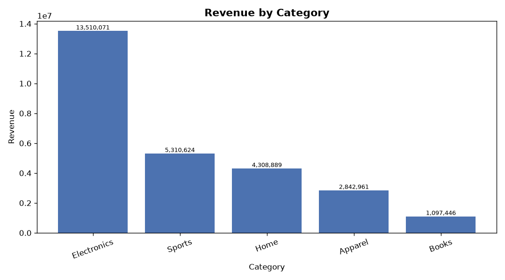
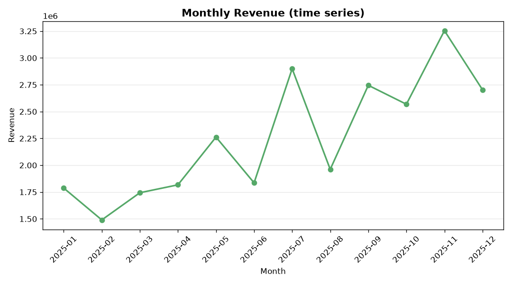
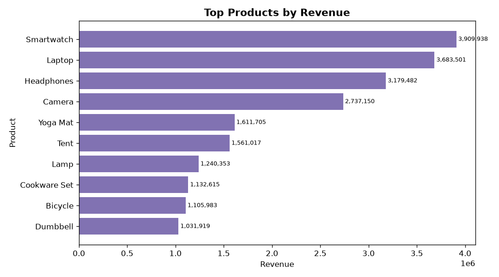
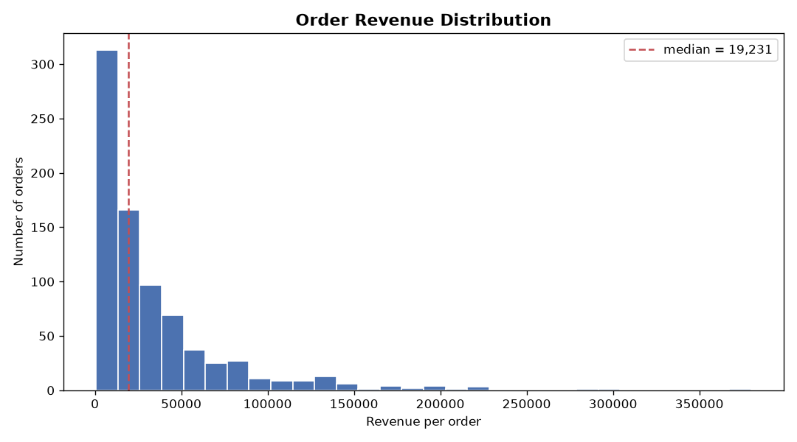

# 売上データ分析レポート — 架空オンラインストア（サンプル）

> 本レポートは **Tatara（AI エージェント）が自律生成** したポートフォリオ成果物です。
> 入力データは **合成（シミュレーション）サンプルデータ** であり、実在の企業・顧客・取引では
> ありません（外部の商用データを無断取得したものでもありません）。`data_gen.py` が乱数シードを
> 固定して決定論的に生成します。**レポート中の数値はすべて、その合成データを実際に集計して
> 得たもの**で、手入力・捏造はありません。

## データ概要

| 指標 | 値 |
|---|---|
| 対象期間 | 2025-01-01 〜 2025-12-28 |
| 総注文数 | 800 |
| 総売上 | 27,069,991 |
| 総販売数 | 4,322 |
| 平均注文額 | 33,838 |
| 中央注文額 | 19,231 |
| 売上の標準偏差 | 42,058 |
| 平均割引率 | 5.06% |

## 主要な洞察（insights）

- 総売上 27,069,991 のうち最大の貢献カテゴリは **Electronics**（13,510,071、全体の 49.9%）でした。
- 地域別では **North** が最も売上が高く（7,037,849）、4 地域の中で先頭でした。
- 月次では **2025-11**（3,254,363）が最も売上が高く、最も低い **2025-02**（1,490,285）の約 2.18 倍でした。年末商戦に向けた季節性が読み取れます。
- 商品別の売上首位は **Smartwatch**（3,909,938）でした。
- 相関分析では、売上は **単価との相関が最も強く**（r=0.808）、次いで数量（r=0.424）と連動していました。割引率との相関は -0.065 で、売上を強く左右する主因ではありませんでした。
- 1 注文あたりの売上は平均 33,838 / 中央 19,231 で、平均が中央を上回ることから、少数の高額注文が分布の裾を押し上げる右裾型の分布です。

## カテゴリ別 集計

| カテゴリ | orders | revenue | avg_order_value |
|---|---|---|---|
| Electronics | 157 | 13,510,071 | 86,051 |
| Sports | 155 | 5,310,624 | 34,262 |
| Home | 151 | 4,308,889 | 28,536 |
| Apparel | 167 | 2,842,961 | 17,024 |
| Books | 170 | 1,097,446 | 6,456 |

## 地域別 集計

| 地域 | orders | revenue |
|---|---|---|
| North | 207 | 7,037,849 |
| West | 208 | 6,731,361 |
| East | 181 | 6,699,905 |
| South | 204 | 6,600,876 |

## 月次売上（時系列）

## 商品別 売上トップ 10

| 商品 | 売上 |
|---|---|
| Smartwatch | 3,909,938 |
| Laptop | 3,683,501 |
| Headphones | 3,179,482 |
| Camera | 2,737,150 |
| Yoga Mat | 1,611,705 |
| Tent | 1,561,017 |
| Lamp | 1,240,353 |
| Cookware Set | 1,132,615 |
| Bicycle | 1,105,983 |
| Dumbbell | 1,031,919 |

## 売上の分布

## 数値指標の相関行列

| | quantity | unit_price | discount_pct | revenue |
|---|---|---|---|---|
| quantity | 1.000 | 0.014 | -0.012 | 0.424 |
| unit_price | 0.014 | 1.000 | -0.011 | 0.808 |
| discount_pct | -0.012 | -0.011 | 1.000 | -0.065 |
| revenue | 0.424 | 0.808 | -0.065 | 1.000 |

> 売上（revenue）は単価（unit_price）・数量（quantity）から導出されるため、これらと正の相関を
> 持つのは設計上自然です。相関「分析」が実データ上で構造を正しく検出できることの確認になります。

---

*生成パイプライン: `data_gen.py`（合成データ生成）→ `analyze.py`（集計）→ `visualize.py`（可視化）→ `report_gen.py`（レポート統合）*
