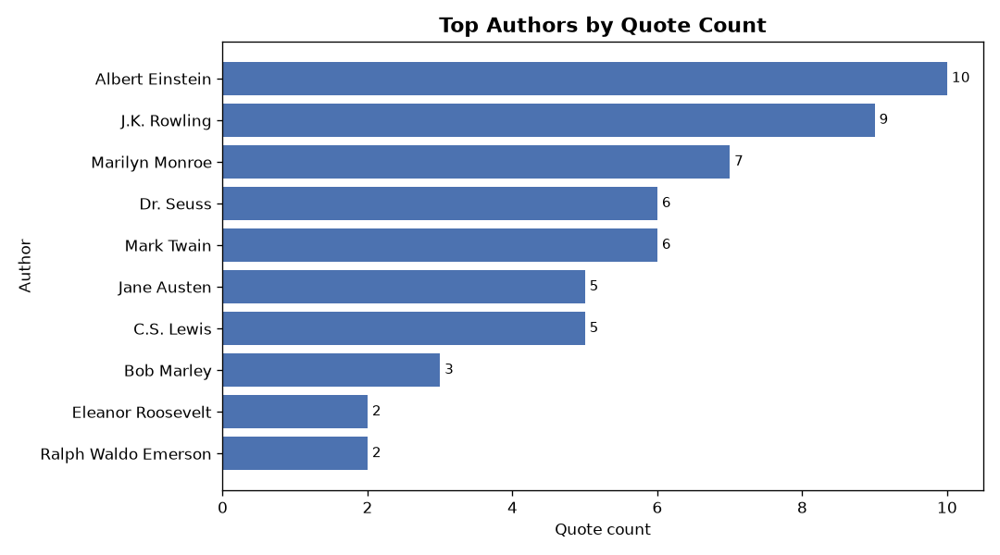
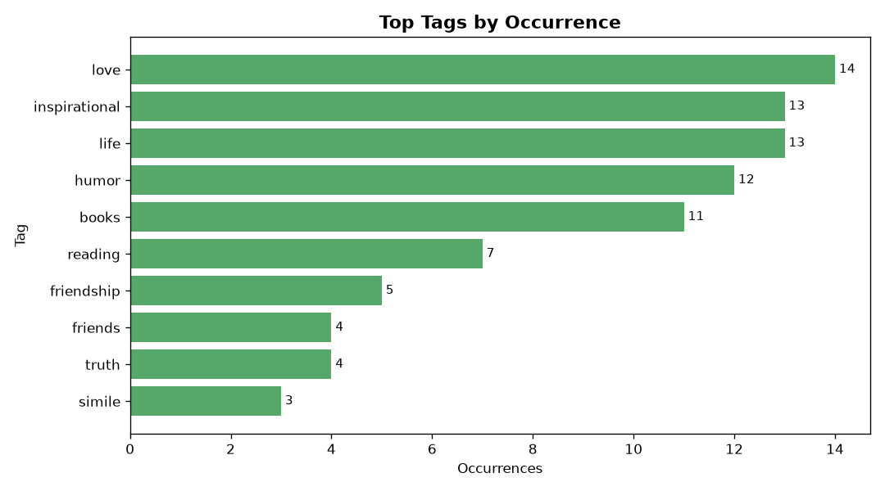

# Web スクレイピング分析レポート — quotes.toscrape.com

> 本レポートは **Tatara（AI エージェント）が自律生成** したポートフォリオ成果物です。
> データは練習用公開サイト `https://quotes.toscrape.com` を実際にスクレイピングして取得した実データです（捏造なし）。

## 概要

| 指標 | 値 |
|---|---|
| 総引用件数 | 100 |
| ユニーク著者数 | 50 |
| ユニークタグ数 | 137 |
| 引用文の平均文字数 | 120.3 |
| 引用文の中央文字数 | 84.0 |
| 引用文の最大文字数 | 1082 |
| 引用文の最小文字数 | 32 |

## 著者別 引用件数（トップ 10）

| 著者 | 引用件数 |
|---|---|
| Albert Einstein | 10 |
| J.K. Rowling | 9 |
| Marilyn Monroe | 7 |
| Dr. Seuss | 6 |
| Mark Twain | 6 |
| Jane Austen | 5 |
| C.S. Lewis | 5 |
| Bob Marley | 3 |
| Eleanor Roosevelt | 2 |
| Ralph Waldo Emerson | 2 |

## タグ出現頻度（トップ 10）

| タグ | 出現数 |
|---|---|
| love | 14 |
| inspirational | 13 |
| life | 13 |
| humor | 12 |
| books | 11 |
| reading | 7 |
| friendship | 5 |
| friends | 4 |
| truth | 4 |
| simile | 3 |

## 所見

- 収集した 100 件の引用は 50 名の著者に由来し、最も引用が多いのは **Albert Einstein**（10 件）でした。
- タグでは **love**（14 回）が最頻出で、引用の主題傾向を示します。
- 引用文の長さは平均 120.3 文字（32〜1082 文字）に分布しています。

---

*生成パイプライン: `scraper.py`（収集）→ `analyzer.py`（集計）→ `report_gen.py`（可視化・レポート）*
